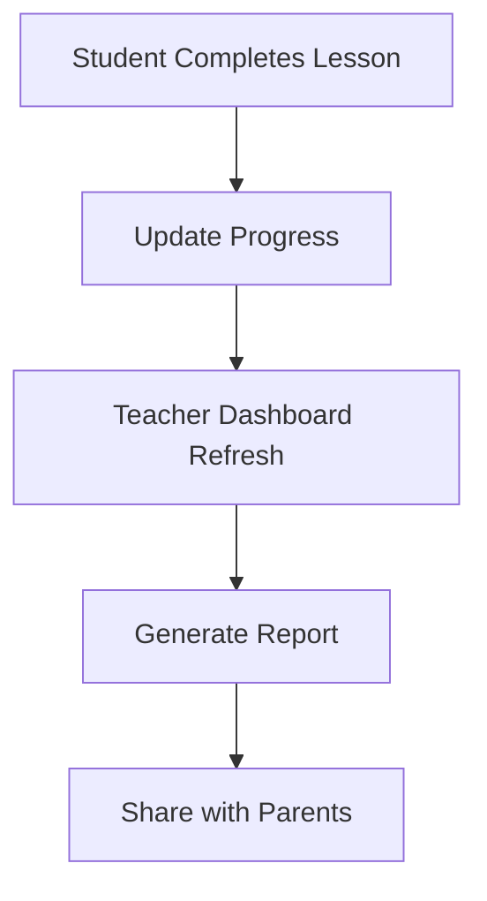

## Overview

Llamaroo empowers teachers to build engaging, gamified courses for elementary students using AI tools and interactive features. You create lessons in minutes, customize for specific grade levels, track progress, and foster classroom collaboration. Key capabilities include AI generation, quizzes with rewards, grade-specific adaptations, real-time analytics, and shared class spaces.

<Columns cols={2}>
  <Card title="AI Course Builder" icon="zap" href="/quickstart">
    Generate complete lessons from simple prompts.
  </Card>
  <Card title="Gamified Quizzes" icon="star" href="/guides">
    Add points, badges, and leaderboards to boost motivation.
  </Card>
  <Card title="Grade Customization" icon="settings" href="/configuration">
    Tailor content for Pre-K through Grade 8.
  </Card>
  <Card title="Progress Analytics" icon="bar-chart" href="/authentication">
    Monitor student advancement with detailed reports.
  </Card>
</Columns>

## AI Tools for Course and Lesson Generation

Start building courses with Llamaroo's AI assistant. Enter a topic like "Solar System Basics," select a grade level, and generate structured lessons with activities.

<Steps>
  <Step title="Prompt the AI" icon="bot">
    Navigate to the dashboard and describe your lesson.

    ```
    Create a Pre-K lesson on animals with matching games.
    ```
  </Step>
  <Step title="Review and Edit" icon="edit">
    Preview the generated content, adjust activities, and add images.
  </Step>
  <Step title="Publish" icon="upload">
    Share the class code with students to join instantly.
  </Step>
</Steps>

<Callout kind="tip">
  Use specific prompts like "Grade 3 math: fractions with pizza examples" for best results.
</Callout>

## Interactive Elements and Rewards

Engage students with quizzes, drag-and-drop activities, and gamification. Earn stars for correct answers and unlock badges for milestones.

<Tabs>
  <Tab title="Quizzes" icon="check-circle">
    Embed multiple-choice or open-ended questions.

    ```json
    {
      "question": "What is 2 + 3?",
      "options": ["4", "5", "6"],
      "correct": 1,
      "points": 10
    }
    ```
  </Tab>
  <Tab title="Rewards" icon="award">
    Set up leaderboards and redeemable stars.

    ```json
    {
      "badge": "Math Master",
      "unlockAt": 100,
      "reward": "Virtual sticker pack"
    }
    ```
  </Tab>
</Tabs>

## Customization for Different Grade Levels

Adapt lessons to fit Pre-K through Grade 8. Use templates that adjust complexity automatically.

| Grade Level | Focus Areas | Example Activities |
|-------------|-------------|--------------------|
| Pre-K      | Colors, Shapes | Matching games, songs |
| K–2        | Basic Reading/Math | Simple quizzes, stories |
| 3–5        | Science/Social Studies | Interactive maps, experiments |
| 6–8        | Advanced Concepts | Projects, debates |

<Expandable title="Advanced Customization Options" default-open="false">
  Override defaults with custom timing, difficulty sliders, and multimedia embeds. For instance, add videos via `{videoUrl}` in lesson configs.
</Expandable>

## Progress Tracking and Collaboration

View real-time dashboards for individual and class progress. Teachers track completion rates, while students see personal streaks.



<CodeGroup tabs="Dashboard API,Class Code">
  ```javascript
  fetch('https://api.llamaroo.com/progress?classId=YOUR_CLASS_ID', {
    headers: { Authorization: `Bearer ${YOUR_TOKEN}` }
  }).then(res => res.json());
  ```
  ```bash
  llamaroo join YOUR_CLASS_CODE
  ```
</CodeGroup>

Collaborate by inviting co-teachers or sharing editable links. Students join via class codes for seamless group work.

<Callout kind="info">
  Export reports as PDF for parent-teacher conferences.
</Callout>